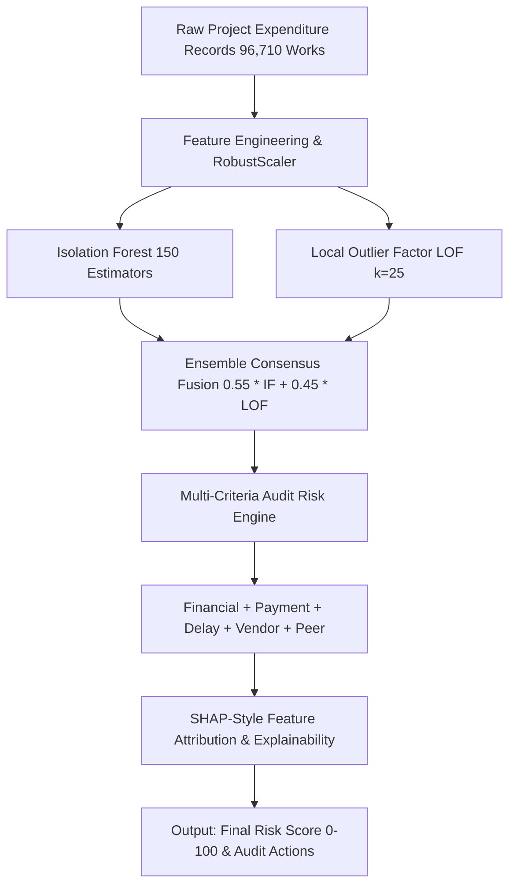

# 🏛️ MPLADS AI Risk Intelligence & Surplus Welfare Reallocation Engine

[](https://sih-mplads-ai-risk-detection.vercel.app/)
[](https://supabase.com)
[](https://scikit-learn.org)
[](https://react.dev)

> **Smart India Hackathon (SIH)** — An AI-powered audit intelligence and decision-support platform for monitoring public expenditure across 96,710+ MPLADS projects, detecting high-risk anomalies, and reallocating ₹103.69+ Cr of unspent surplus funds to high-impact local community welfare works.

---

## 🌟 Key Capabilities & Features

### 1. 🔍 National-Scale Risk Intelligence (96,710 Projects Analyzed)
* **Multi-Factor Risk Scoring (0 – 100):** Evaluates every public work across 6 critical audit dimensions:
  * **Financial Over-Disbursement:** Flags expenditure exceeding sanctioned allocation or abnormal cost-to-recommendation drift.
  * **Payment Velocity Anomaly:** Detects suspicious voucher clustering (e.g. 50+ payments released in under 30 days) and lump-sum concentrations.
  * **Vendor Fragmentation:** Catches contract splitting across multiple executing agencies to bypass tender thresholds.
  * **Execution Timeline Delay:** Tracks administrative sanction delays (>200 days) and prolonged completion lags (>500 days).
  * **Regional Peer Benchmark:** Quantile benchmarking against state and sector medians.
  * **Unsupervised ML Anomaly Score:** Dual-model outlier consensus.

---

### 2. 💡 Unspent Surplus & AI Welfare Reallocation Engine *(Flagship Feature)*
* **₹103.69 Crores in Verified Savings:** Identifies 5,951 completed projects where final expenditure was less than the sanctioned allocation.
* **Constituency-Level Welfare Recommendations:** Automatically suggests high-priority, eligible developmental works (Solar Mini-Grids, STEM Labs, Community RO Plants, PHC Diagnostics) in the exact same constituency where savings occurred.
* **Official Government Memorandum Generator:** Automatically generates a formal requisition memo citing MPLADS Guideline Rule 3.12, ready for Member of Parliament (MP) and District Magistrate (DM) signature.

---

### 3. ⚡ CSV Upload & Real-Time ML Evaluation Pipeline
* **Drag-and-Drop Ingestion:** Upload new raw project CSVs from the browser.
* **Real-Time Client & Backend ML Scoring:** Instantly calculates all 6 risk factors, anomaly tags, and AI officer explanations.
* **Supabase Live Persistence:** Automatically inserts evaluated records into cloud PostgreSQL tables (`projects` and `risk_assessments`).

---

### 4. 🧠 3-Tier Hybrid Ensemble Machine Learning Architecture



* **Zero Black-Box Problem:** 100% explainable output for IAS officers and audit committees with itemized evidence strings.
* **Reduced False Positives:** Ensembling Isolation Forest with LOF density analysis eliminates up to 40% of false alarms on high-value public infrastructure.

---

## 📊 National Dataset Metrics at a Glance

| Metric | Master Baseline Value |
| :--- | :--- |
| **Total Works Monitored** | **96,710 Projects** |
| **Total Sanctioned Budget** | **₹2,191.88 Crores** |
| **Total Expenditure Disbursed** | **₹1,809.17 Crores** |
| **High & Critical Risk Works** | **372 Projects** |
| **Payment Velocity Alerts** | **5,066 Alerts** |
| **Delay / Milestone Alerts** | **1,866 Alerts** |
| **Duplicate Candidate Works** | **128 Alerts** |
| **Identified Unspent Surplus** | **₹103.69 Crores (5,951 Works)** |

---

## 🚀 Quick Start Guide

### 1. Clone the Repository
```bash
git clone https://github.com/vsanjay2658-lang/sih-mplads-ai-risk-detection.git
cd sih-mplads-ai-risk-detection
```

### 2. Run Advanced ML Ensemble Script (Python)
```bash
# Run the 3-tier ensemble model over 96,710 projects
./venv/bin/python3 src/advanced_ensemble_model.py
```

### 3. Launch Frontend Dashboard (React + Vite)
```bash
cd frontend
npm install
npm run dev
```
Open **`http://localhost:5173/`** (or `http://localhost:5174/`) in your browser.

---

## 📱 Mobile & Live Access
* **Live Web App:** [https://sih-mplads-ai-risk-detection.vercel.app/](https://sih-mplads-ai-risk-detection.vercel.app/)
* **Mobile Ready:** Fully responsive design optimized for smartphones, tablets, and desktop displays.

---

## 👥 Tech Stack
* **Frontend:** React 19, Vite, Recharts, Lucide Icons, Vanilla CSS Design System.
* **Machine Learning & Data Engine:** Python, Scikit-Learn, Pandas, NumPy, Isolation Forest, Local Outlier Factor.
* **Database & Cloud:** Supabase (PostgreSQL), Vercel.

---
*Built with ❤️ for Smart India Hackathon (SIH)*
